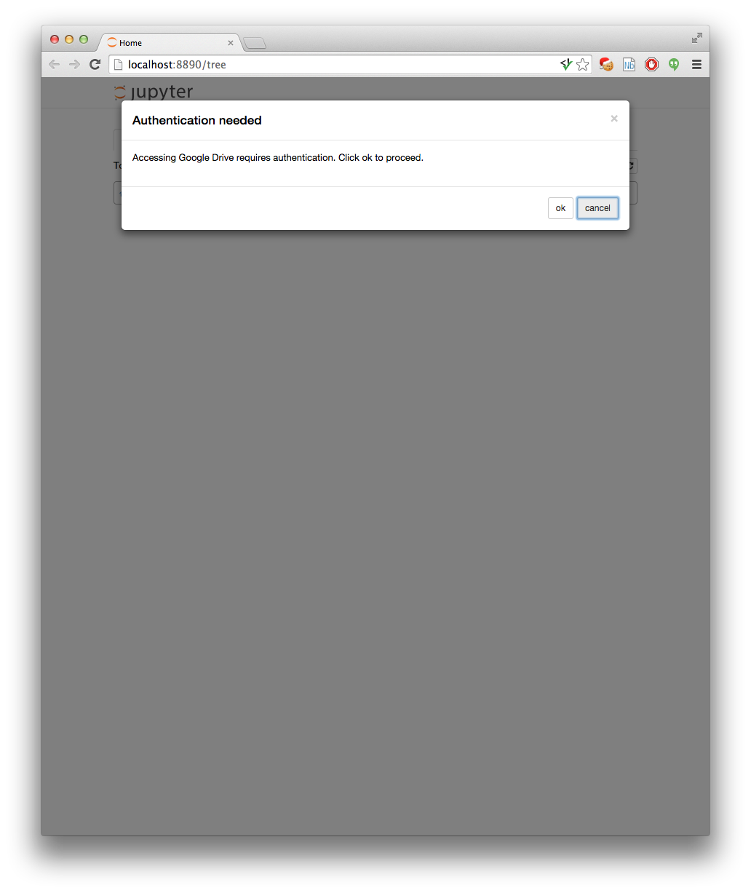

# Google Drive support for Jupyter Notebook

This repository contains custom
[`Contents`](https://github.com/ipython/ipython/blob/master/IPython/html/static/services/contents.js) classes that allows IPython to use
Google Drive for file management.  The code is a organized as a python package
that contains functions to install a Jupyter Notebook JavaScript extension,
and activate/deactivate different IPython profiles to be used with Google drive.

To install this package, clone this repository locally and run

```bash
pip install -e .
```

This will install the package in development mode with pip, which means that any
change you make to the repository will be reflected into the importable version
immediately.

To install the notebook extension and activate your profile with Google
Drive, run

```bash
python -m jupyterdrive <profile_name>
```

Be sure that the profile exist before running the command.
You can create a new profile with

```bash
ipython profile create <profilename>
```

Please refer to IPython documentation for more info on profiles.

## Symlink files

By default all the Javascript files will be symlinked, so any update to the package python
or javascript will be reflected on your python server.
use the  `--no-symlink` option to actually copy the file on their final destination.

## Mixed contents

You can also installed the `MixedContentsManager`, to do so install as previously with
the `--mixed` options. For example on the default profile :

```bash
python -m jupyterdrive default --mixed
```

The mixed content manager will show both contents from local hard drive and remote
google drive as two directory in your dashboard.


## Other options

If IPython has been installed system wide, in a virtual environment or with
some custom setup you might need to pass `--user`, `-prefix <prefix>` or
`--path <path>` option to install the extension in a user-owned profile
location.

See `python -m jupyterdrive --help` for more information.

## deactivate a profile

It is not yet possible to deactivate the drive integration automatically. But
you can get rid of `~/.ipython/profile_defaut/ipython_notebook_config.json`
config file to deactivate Google Drive as well as other config options.

The configuration of IPython/Jupyter is done through the `.json` file in the
profile situated in the profile and will take precedence on configuration done
in `.py` files, though you can still use non conflicting options.

# First launch

On first launch, the application will ask you for the authorization to access
your files on Google Drive.  It only asks for permission to create new files or
 access files it has created or that you manually open with this application.
It also requires permission to access file/directory metadata, in order
to display the list of files/directories in the tree view.

The request pop-up looks like the following:



Clicking ok will open a Google OAuth pop-up.  You will see that the `Jupyter
Drive` application want access to some informations about your files. Keep that
in mind if you want to revoke access at a later point.


Once you click `Accept` you should be able to start creating new notebooks on
Google Drive, and open existing ones created by this application, and
view files/directories in the tree view.

## Advance configuration.

The contens manager can access the `common` section of nbconfig, thus
you can set config values in `<profile_dir>/nbconfig/common.json`. The default
value that are use are the following:

```json

{"gdrive":
    {
    "METADATA_SCOPE": true,
    "FILE_SCOPE": true,
    "CLIENT_ID": "763546234320-uvcktfp0udklafjqv00qjgivpjh0t33p.apps.googleusercontent.com"
    }
}
```

The `APP_ID` section is not yet configurable, but shoudl be configurable in the
same way at some point in the future.
